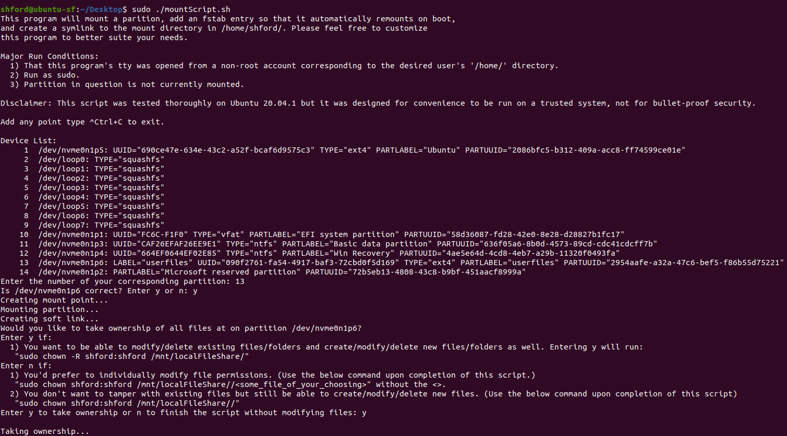

# Bash Scripts
> A bash script to mount a partition, add a symlink, and add an fstab entry.

This script should be pretty idiot proof so hopefully someone else will also enjoy being able to conveniently access one shared local partiton across different linux OS's from a directory of their choosing.



## Installation

In a Linux terminal:

```sh
cd /~/Desktop/
git clone https://github.com/shford/Add-Local-Shared-Partition.git
chmod 744 mountScript.sh
sudo ./mountScript.sh
```

## Release History

Script was fully functional during all testing on Ubuntu 20.04.01. Please let me know if there are any issues.

## Meta

Distributed under the MIT license.

## Contributing

1. Fork it (<https://github.com/yourname/yourproject/fork>)
2. Create your feature branch (`git checkout -b feature/fooBar`)
3. Commit your changes (`git commit -am 'Add some fooBar'`)
4. Push to the branch (`git push origin feature/fooBar`)
5. Create a new Pull Request
